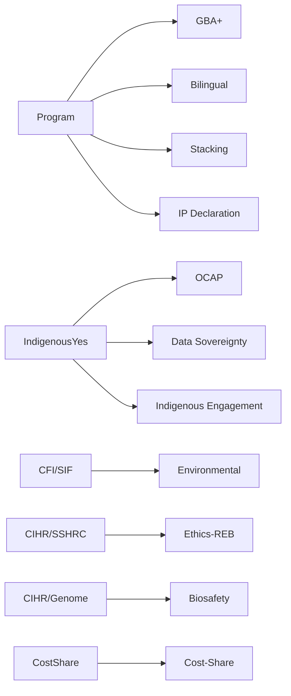
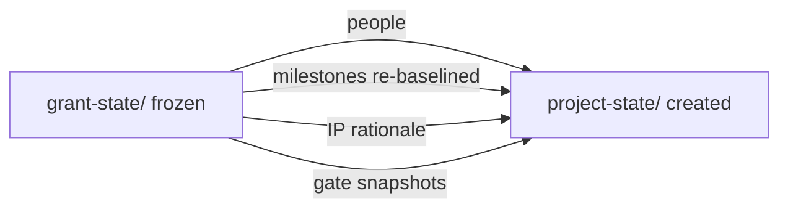

# Grant Scaffolder

## Purpose

Initialize a `grant-state/` submission facility and manage the award handoff to `project-state/`. Used twice per grant:
1. **At submission start** — scaffold the facility.
2. **On award** — freeze the facility, spawn `project-state/`, carry forward artifacts.

## Presentation Protocol

### Surface detection

At invocation, detect the rendering surface:
- **Coworker / claude.ai** — HTML artifact mode (interactive wizard)
- **Claude Code (CLI)** — markdown mode (progress line + mermaid + numbered prompts)

### Design system

Shared with `project-scaffolder`. Colors: primary-green `#22c55e`, primary-green-bg `#f0fdf4`, text-main `#111827`, text-muted `#6b7280`, border `#e5e7eb`, amber-bg `#fffbeb`.
Components: ProgressBar, OptionCard, SelectedCard, FormField, ToggleCard, SummaryRow, StatusRow, NavRow.

### Wizard steps (scaffolding path)

**Step 1 — Program Selection**

_HTML artifact:_ 4-step ProgressBar (Step 1 active). SectionTitle "Select your program." Display the 19 playbooks as OptionCards in a 4-column grid with program name and one-line description. Include a search/filter input above the grid. One "Other / not listed" fallback card triggers `_agnostic-core`. NavRow: [Next →] (disabled until one card selected).

_Markdown:_ Progress: `Step 1 of 4 — Program Selection`. Present as markdown table with playbook ID + matches. Ask: "Which Canadian program are you applying to? Type the program name."

---

**Step 2 — Project Inputs**

_HTML artifact:_ 4-step ProgressBar (Step 2 active). SectionTitle "Project details." Display playbook match result as a SelectedCard (green-bg, program name, match confidence badge). Then a series of FormField components:
- Project short name (slug)
- Project long name
- Deadline (date picker or ISO input; show "Continuous intake" toggle)
- Lead organization
- PI name + email
- Consortium shape (3 OptionCards: single-applicant / single-pi-with-partners / multi-party-consortium)
- Provinces / regions (multi-select chips)
- Indigenous engagement (3 OptionCards: Yes / No / Unsure — Unsure shows amber OCAP note)
- Surfaces (3 ToggleCards: Slack / Gmail / Calendar)
- Parent directory (text field)

NavRow: [Back] [Next →].

_Markdown:_ Ask each input in sequence. For consortium shape, display as numbered options. For surfaces, ask as yes/no per surface.

---

**Step 3 — Compliance Gate Preview**

_HTML artifact:_ 4-step ProgressBar (Step 3 active). SectionTitle "Compliance gates for [program]."

Top: a Mermaid diagram showing the gate activation map for the selected playbook:


Below: a table of gates with status chips — `required` (green) / `recommended` (amber) / `not-applicable` (gray). Each gate has a one-line description.

NavRow: [Back] [Next →].

_Markdown:_ Render as Mermaid code block. Then show a markdown table of gates with required / recommended / N/A status.

---

**Step 4 — Review & Confirm**

_HTML artifact:_ 4-step ProgressBar (Step 4 active). SectionTitle "Review and confirm."

Left panel: SummaryRows for all inputs (Program, Deadline, Lead org, PI, Consortium shape, Provinces, Indigenous engagement, Surfaces, Directory). Each row shows source badge if pre-filled from inbox documents.

Right panel: facility directory tree preview:
```
grant-state/<slug>/
├── manifest.yaml
├── state.json
├── program-record.yaml
├── sections/          (N sections from playbook)
├── gates/             (N gates)
├── letters/
├── budget/
├── sources/
├── documents/
│   ├── inbox/
│   └── working/
└── logs/
    ├── activity.ndjson
    └── decisions.ndjson
```

Large [Scaffold grant-state/ →] button. Warning: "This creates the grant-state/ directory and initializes git."
NavRow: [Back] [Scaffold grant-state/ →].

_Markdown:_ Show summary table of all inputs. Show facility tree as code block. Ask: "Ready to scaffold? Type 'yes' to confirm."

---

**Step 5 — Build Output**

After scaffolding completes:

_HTML artifact:_ StatusRow list of every file created (✓ prefix). Then 2 next-step OptionCards:
- "Drop program documents → grant-state/documents/inbox/ and run /grant-ingestor triage"
- "Invite collaborators → run /project-notifier to share access"

_Markdown:_ Render StatusRows as a checklist. Print next-step instruction block.

---

### Award handoff wizard (on "we won the grant")

Present as a 3-step mini-wizard:

**Step A — Award details:** FormFields for award date, sponsor ref, award amount, conditions, target directory for project-state/.

**Step B — Carry-forward preview:** SummaryRows showing what will be carried forward (N people, N milestones, IP rationale, N gates). Mermaid diagram of the handoff flow:


**Step C — Confirm:** [Freeze grant-state/ and create project-state/ →] button. On completion, render StatusRows of all actions taken.

---

## Inputs (ask the user if not provided — only in markdown / Claude Code mode)

1. **Program name** — which Canadian program? (used to match playbook)
2. **Deadline** — ISO date, or `null` for continuous-intake programs
3. **Project short name** — slug used as directory name
4. **Project long name** — full descriptive title
5. **Lead organization** — signs the submission
6. **PI name and email**
7. **Consortium shape** — `single-applicant` | `single-pi-with-partners` | `multi-party-consortium`
8. **Provinces/regions** — for regional agency eligibility checks
9. **Indigenous engagement** — `yes` | `no` | `unsure` (drives OCAP gate default)
10. **Surfaces** — Slack / Gmail / Calendar desired?
11. **Parent directory** — where to create the facility

## Playbook matching

Match `program_name` against the playbook library (case-insensitive, fuzzy):

| Playbook ID | Matches |
|---|---|
| `tri-council-nserc-alliance` | NSERC Alliance, NSERC Alliance-Industry, NSERC |
| `tri-council-nserc-discovery` | NSERC Discovery |
| `tri-council-sshrc` | SSHRC, Social Sciences, Humanities |
| `tri-council-cihr` | CIHR, Health Research |
| `irap` | IRAP, NRC-IRAP, Industrial Research Assistance |
| `sif` | SIF, Strategic Innovation Fund |
| `pic` | PIC, Protein Industries Canada, PCAIS |
| `cfi-jelf` | CFI, JELF, John R. Evans Leaders Fund |
| `mitacs-accelerate` | Mitacs, Accelerate, Elevate |
| `ngen` | NGen, Next Generation Manufacturing |
| `scale-ai` | SCALE.AI |
| `genome-canada` | Genome Canada, Genomics |
| `pacifican-bsp` | PacifiCan, BSP, Pacific Economic Development |
| `feddev-ontario-bsp` | FedDev, FedDev Ontario |
| `fednor` | FedNor, Northern Ontario |
| `ced-quebec` | CED, Développement économique Canada |
| `acoa` | ACOA, Atlantic Canada Opportunities |
| `cannor` | CanNor, Canadian Northern Economic Development |
| `sred` | SR&ED, Scientific Research, Experimental Development |
| `_agnostic-core` | fallback for unrecognized programs |

Match confidence:
- `exact` — program name matches playbook keyword directly
- `fuzzy` — partial match; confirm with user before proceeding
- `fallback-agnostic` — no match found; use agnostic-core and note gaps

## What gets scaffolded

```
grant-state/
├── manifest.yaml              (seeded from inputs + playbook)
├── state.json                 (phase: prospect, counters zeroed)
├── program-record.yaml        (program requirements from playbook)
├── sections/                  (one YAML per required narrative section from playbook)
├── gates/                     (one YAML per compliance gate — see gate defaults below)
├── letters/                   (empty; letter stubs added per playbook requirements)
├── budget/                    (budget scaffold from playbook)
├── sources/                   (empty; grant-ingestor populates)
├── citations/                 (empty)
├── findings/                  (empty)
├── documents/
│   ├── inbox/
│   └── working/
└── logs/
    ├── activity.ndjson        (project.scaffolded event)
    └── decisions.ndjson
```

## Compliance gate defaults by geography and engagement

Seed gates with applicability based on inputs:

| Gate | Required when |
|---|---|
| `ocap` | `indigenous_engagement == yes` |
| `gba-plus` | Tri-Council, SIF, NGen, SCALE.AI, CFI |
| `bilingual` | All federal programs (required or recommended) |
| `tto-routing` | Any program requiring IP declaration |
| `stacking` | All programs (disclosure of co-funding) |
| `ip-declaration` | All programs |
| `indigenous-engagement` | `indigenous_engagement == yes or unsure` |
| `environmental` | CFI, SIF, programs with physical infrastructure |
| `cost-share` | Programs with cash/in-kind requirements |
| `ethics-reb` | CIHR, SSHRC, programs involving human subjects |
| `biosafety` | CIHR, Genome Canada, programs with biological materials |
| `data-sovereignty` | Any program involving Indigenous data |

## Git initialization

After scaffolding, initialize a git repo in the facility's parent directory:
1. Check for existing `.git`. If present, skip `git init`.
2. Run `git init` in parent directory (or project root if nested).
3. Write `.gitattributes`:
   ```
   grant-state/logs/*.ndjson merge=union
   ```
4. Initial commit: `git commit -m "grant-state: facility scaffolded — <slug>"`

## Output

After scaffolding, render Step 5 — Build Output (see Presentation Protocol above):
1. Show the facility tree (StatusRows or code block per surface).
2. Show which sections were seeded and gates set to required / recommended / not-applicable.
3. Log `grant.scaffolded` to `logs/activity.ndjson`.
4. Show next step: "Drop the program guide and eligibility docs into `grant-state/documents/inbox/`, then run `/grant-ingestor triage`."

---

## Award handoff

When the user says "we won the grant" / "record award" / "award confirmed":

### Inputs needed
- Award date (ISO)
- Sponsor reference number
- Award amount
- Award conditions (if any)
- Target directory for `project-state/` (usually sibling of `grant-state/`)

### Steps

1. **Write `grant-state/award-record.yaml`:**
   ```yaml
   id: award-record
   kind: award-record
   outcome: awarded
   award_date: <ISO date>
   sponsor_ref: <ref>
   award_amount: <amount>
   conditions: <any special conditions>
   frozen_at: <ISO-8601 UTC>
   ```

2. **Freeze the facility.** Write `grant-state/state.json:phase = awarded` and `frozen: true`. Add a `FROZEN.md` to `grant-state/`: "This submission facility is frozen. All subsequent project work is in `../project-state/`."

3. **Read carry-forward artifacts:**
   - Consortium people (from `manifest.yaml:consortium_members`)
   - IP rationale (from `sources/` + `gates/ip-declaration.yaml`)
   - Gate snapshots (all cleared gates)
   - Milestones from `program-record.yaml:required_milestones` (re-baseline to execution dates)
   - `grant-state/` path (for provenance references in `project-state/`)

4. **Call `project-scaffolder`** to initialize `project-state/` in the target directory. Pass the grant-canada pack and the carry-forward data as pre-fill.

5. **Populate `project-state/` with carry-forward data:**
   - `people/` — consortium member YAMLs with roles from the submission
   - `documents/inbox/ip-rationale.md` — IP rationale narrative from submission
   - `milestones/` — re-baselined milestone YAMLs with `source: grant-state/<slug>` provenance
   - Decision: "Adopted project-state/ facility — award from <program> (ref: <sponsor-ref>)"

6. **Log events:**
   - In `grant-state/logs/activity.ndjson`: `award.recorded`, `facility.frozen`, `project-state.spawned`
   - In `project-state/logs/activity.ndjson`: `project.scaffolded`, `grant-state.carryforward-applied`

7. **Report:**
   ```
   Award handoff complete.

   Frozen: grant-state/<slug>/  (read-only; provenance preserved)
   Created: project-state/      (execution facility, execution phase)

   Carried forward:
     N consortium members → project-state/people/
     IP rationale         → project-state/documents/inbox/
     N milestones         → project-state/milestones/ (re-baselined to execution dates)
     N gate snapshots     → project-state/compliance/

   Next: run `/project-onboarding` in project-state/ to complete setup.
   ```

---

## Rejection handling

When "we didn't get it" / "submission rejected":
1. Write `grant-state/award-record.yaml` with `outcome: rejected`.
2. Set `state.json:phase = rejected`.
3. Offer: "Run `/grant-ingestor lessons` to capture submission lessons learned before archiving."
4. Offer to copy promising sections to a `reuse/` folder for next submission cycle.

---

## Discipline

- **Idempotent.** If `grant-state/` exists, abort with warning; offer `grant-state validate` instead.
- **Confirm before writing.** Confirm inputs and playbook match before creating files.
- **Never overwrite existing files.**
- **On award: never auto-create `project-state/` without user confirmation.**

## Integration

- **grant-state** — all facility reads/writes route through it.
- **grant-ingestor** — called after scaffold to drain inbox and produce strategy pass.
- **project-scaffolder** — called on award to spawn execution facility.
- **project-git** — git initialization is part of scaffolding; subsequent checkpointing via `project-git`.
