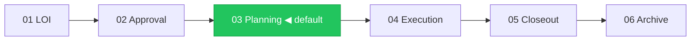
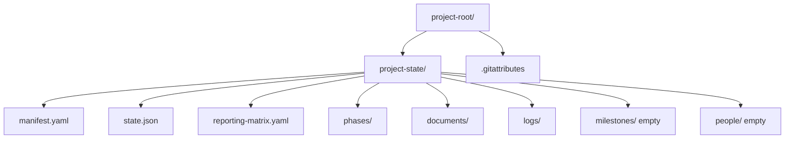

# Project Scaffolder

## Purpose

Stand up a fresh `project-state/` in a new working directory. Ensures the facility starts correctly-shaped so the other `project-*` skills can operate.

Used once per project at kickoff. The experience runs as a 6-step wizard with a post-confirm build step.

## Trigger phrases

- "set up a new project"
- "scaffold a project"
- "initialize project-state" / "init project-state"
- "create a new project-state"
- "start a new funded project" / "bootstrap a grant project"
- "new consortium project"

---

## Presentation Protocol

project-state runs on two surfaces. Detect and adapt before Step 1.

### Surface detection

Check the runtime context:
- **Claude Coworker / claude.ai web** → HTML artifact mode. Each wizard step is a rendered HTML artifact with real buttons.
- **Claude Code (CLI)** → Markdown mode. Each step uses Mermaid blocks, tables, and bold numbered options.

Default to HTML artifact mode. If artifact rendering is not available, fall back to markdown mode automatically.

### Design system (HTML artifact mode)

All HTML artifacts share this design system. Generate consistent, minimal UI:

```
Container:  font-family: system-ui; max-width: 680px; margin: 0 auto; padding: 24px
Colors:
  primary-green:    #22c55e  (active step, confirm button, selected border)
  primary-green-bg: #f0fdf4  (selected card background)
  text-main:        #111827
  text-muted:       #6b7280
  border:           #e5e7eb
  badge-production: bg #dcfce7  text #166534
  badge-starter:    bg #fef9c3  text #a16207
  badge-new:        bg #dbeafe  text #1e40af

Components:
  ProgressBar     — flex row of N divs (height 4px, border-radius 2px).
                    Completed steps = primary-green, pending = border-color.
  StepLabel       — "Step N of 6 — [Name]" in 12px text-muted, margin-bottom 20px.
  SectionTitle    — 18px font-weight 600, margin-bottom 4px.
  SectionSubtitle — 14px text-muted, margin-bottom 20px.
  OptionCard      — padding 12px 16px, border 1px solid border-color, border-radius 8px,
                    background #fff, cursor pointer, width 100%, text-align left,
                    display flex, justify-content space-between, align-items center.
                    Left: title (14px 600) + subtitle (13px text-muted, margin-top 2px).
                    Right: badge pill (11px, padding 2px 8px, border-radius 12px).
  SelectedCard    — OptionCard with border 2px solid primary-green, background primary-green-bg.
  NavRow          — display flex, justify-content space-between, margin-top 24px.
                    Back button: outline style (border border-color, bg #fff).
                    Primary button: background primary-green, color #fff, border none,
                    padding 10px 20px, border-radius 8px, font-weight 600.
  FormField       — label (12px text-muted font-weight 500) + input (full width,
                    padding 8px 12px, border 1px border-color, border-radius 6px,
                    font-size 14px, margin-top 4px, margin-bottom 16px).
  ToggleCard      — OptionCard with a toggle pill on the right instead of a badge.
                    Toggle on: background primary-green. Toggle off: background border-color.
  SummaryRow      — display grid, grid-template-columns 160px 1fr, gap 8px,
                    padding 10px 0, border-bottom 1px border-color, font-size 14px.
                    Label: text-muted. Value: text-main font-weight 500.
  StatusRow       — 3-column (icon 24px | filename | note text-muted). Icon: ✅ or ⬜.
```

Mermaid in HTML artifacts: use a `<pre class="mermaid">` block and load mermaid.js from CDN:
```html
<script src="https://cdn.jsdelivr.net/npm/mermaid/dist/mermaid.min.js"></script>
<script>mermaid.initialize({startOnLoad:true, theme:'neutral'})</script>
```

Button click behaviour: clicking any option or the primary button sends a message back to Claude with the selection. Claude then generates the next step artifact.

### Markdown mode (Claude Code)

Each step begins with a progress line:
```
── Step N of 6: [Step Name] ──────────────────────────────────────
```

If the step has a diagram, emit a `\`\`\`mermaid` block immediately after the progress line.

Options are presented as a markdown table with bold `**N**` in the first column. The final line of each step is a prompt:
```
> Type a number (or numbers separated by spaces) to select:
```

---

## Wizard Steps

Run steps 1–6 in sequence, one at a time. Wait for the user's response before generating the next step. Do not skip steps. Do not write any files until the user confirms in Step 6.

---

### Step 1: Pack Selection

**Purpose:** Choose which compliance pack(s) to load. Packs seed the reporting matrix and configure the six profile-driven skills.

**HTML artifact:**
- ProgressBar (1 of 6 active)
- StepLabel
- SectionTitle: "Which compliance pack fits your project?"
- SectionSubtitle: "Packs configure reporting cadence, phase gates, and stakeholder routing. You can select more than one — they compose cleanly."
- 7 OptionCards (one per pack) + 1 for "None / custom":

  | Pack | Subtitle | Badge |
  |------|----------|-------|
  | `pic-pcais` | Protein Industries Canada PCAIS consortium | production |
  | `grant-canada` | Canadian grants — NSERC, IRAP, SIF, CFI, Mitacs + 13 more | starter |
  | `sred-canada` | Canadian SR&ED tax credit claims | starter |
  | `client-services` | Client engagement with QBR cadence | starter |
  | `board-investor` | Board and investor reporting | starter |
  | `agile-default` | Engineering team, sprint cadence | starter |
  | `open-source-community` | Community-governed open-source | starter |
  | None / custom | Bare presets — configure manually | — |

- Note below cards: "Tip: grant-canada + sred-canada covers both submissions and SR&ED claims. grant-canada + pic-pcais covers the full PIC lifecycle."
- NavRow: no Back | Continue →

**Markdown output:**
```
── Step 1 of 6: Pack Selection ──────────────────────────────────

Which compliance pack(s) fit your project? Select one or more.

| # | Pack              | Best for                                   | Maturity   |
|---|-------------------|--------------------------------------------|------------|
| 1 | pic-pcais         | Protein Industries Canada PCAIS consortium | 🟢 Prod    |
| 2 | grant-canada      | Canadian grants (NSERC, IRAP, SIF + 12)    | 🟡 Starter |
| 3 | sred-canada       | Canadian SR&ED tax credit claims           | 🟡 Starter |
| 4 | client-services   | Client engagement, QBR cadence             | 🟡 Starter |
| 5 | board-investor    | Board and investor reporting               | 🟡 Starter |
| 6 | agile-default     | Engineering team, sprint cadence           | 🟡 Starter |
| 7 | open-source       | Community-governed open-source             | 🟡 Starter |
| 8 | None / custom     | Bare presets — configure manually          | —          |

> Type a number (e.g. 2 or 2 3 for multiple):
```

---

### Step 2: Phase Selection

**Purpose:** Set the starting phase. The phase determines which gate criteria are active and which phase manifests are marked CURRENT.

**HTML artifact:**
- ProgressBar (2 of 6 active)
- Mermaid diagram of the 6-phase lifecycle with the default phase highlighted:
  ```mermaid
  graph LR
    P1[01 LOI] --> P2[02 Approval] --> P3["03 Planning ◀"] --> P4[04 Execution] --> P5[05 Closeout] --> P6[06 Archive]
    style P3 fill:#22c55e,color:#fff,stroke:#16a34a
  ```
- SectionTitle: "Which phase are you starting in?"
- 4 OptionCards:

  | Phase | Title | When to choose |
  |-------|-------|----------------|
  | `01-loi` | LOI / Pre-proposal | Still writing the application |
  | `02-approval` | Approval | Applied — waiting for funder decision |
  | `03-planning` *(default)* | Planning | Award confirmed, MPA in progress |
  | `04-execution` | Execution | Project already underway |

- NavRow: ← Back | Continue →

**Markdown output:**
```
── Step 2 of 6: Phase Selection ─────────────────────────────────



| # | Phase           | When to choose                        |
|---|-----------------|---------------------------------------|
| 1 | 01 — LOI        | Still writing the application         |
| 2 | 02 — Approval   | Applied, waiting for decision         |
| 3 | 03 — Planning ✓ | Award confirmed, MPA in progress      |
| 4 | 04 — Execution  | Project already underway              |

> Type a number [default: 3]:
```

---

### Step 3: Project Identity

**Purpose:** Collect project name, funder, program, PI/PL, and dates. These seed `manifest.yaml`.

**HTML artifact:**
- ProgressBar (3 of 6 active)
- SectionTitle: "Tell me about the project"
- FormFields in two columns where space allows:
  - Project short name (slug, e.g. `atlas`)
  - Project long name (full title)
  - Funder / sponsor organization
  - Program / contract name
  - Project Lead name + email
  - Project start date (date input)
  - Project end date (date input, optional)
  - Proposal / LOI document path (optional, file path hint)
- NavRow: ← Back | Continue →

**Markdown output:**
Present questions one at a time in sequence. After each response, confirm and move to the next:
```
── Step 3 of 6: Project Identity ────────────────────────────────

I'll ask a few questions about the project. Answer each in turn.

  1. Project short name (used as slug, e.g. atlas):
```
Then after each answer: `Got it. Next:`

---

### Step 4: Consortium & Sharing

**Purpose:** Capture consortium members, the Project Lead organization, and the team sharing model.

**HTML artifact:**
- ProgressBar (4 of 6 active)
- SectionTitle: "Consortium and team sharing"
- Sub-section: **Lead organization** — FormField (org name)
- Sub-section: **Consortium members** — repeating group:
  - Org name + role (member / partner / advisor) + contact email
  - "+ Add member" button
- Sub-section: **Team sharing model** — 3 OptionCards:

  | Model | Description |
  |-------|-------------|
  | **Git** *(recommended)* | `project-state/` lives in a git repo. `project-git` handles checkpointing and sync. Append-only logs merge without conflicts. |
  | **Shared drive** | Dropbox / Google Drive / OneDrive. No git. Advisory lockfiles handle concurrency. |
  | **Single user** | One user, local only. No sharing needed. |

- NavRow: ← Back | Continue →

**Markdown output:**
```
── Step 4 of 6: Consortium & Sharing ────────────────────────────

  Lead organization:
  Consortium members (org, role, email — one per line, blank to finish):

  Sharing model:
  | # | Model         | Description                                      |
  |---|---------------|--------------------------------------------------|
  | 1 | Git ✓         | project-state/ in a git repo — recommended       |
  | 2 | Shared drive  | Dropbox / GDrive / OneDrive, no git              |
  | 3 | Single user   | Local only                                       |

> Sharing model [default: 1]:
```

---

### Step 5: Surfaces

**Purpose:** Configure which external surfaces the project uses. Surface config is stored in `manifest.yaml:surfaces` and read by `project-notifier`.

**HTML artifact:**
- ProgressBar (5 of 6 active)
- SectionTitle: "Which surfaces does the team use?"
- SectionSubtitle: "You can enable or reconfigure these at any time in manifest.yaml."
- 4 ToggleCards, all off by default:

  | Surface | What it does |
  |---------|-------------|
  | **Slack** | Posts status updates and alerts to configured channels |
  | **Gmail** | Creates drafts — never auto-sends |
  | **Google Calendar** | Proposes meeting holds and deadline reminders |
  | **scsiwyg blog** | Publishes project narrative posts through a review queue |

- Each toggle card, when enabled, expands a FormField for the key config value (channel name / calendar ID / site slug)
- NavRow: ← Back | Continue →

**Markdown output:**
```
── Step 5 of 6: Surfaces ────────────────────────────────────────

Which surfaces does the team use? Toggle on/off.

| # | Surface          | Status | What it does                              |
|---|------------------|--------|-------------------------------------------|
| 1 | Slack            | [ ]    | Posts updates to a channel                |
| 2 | Gmail            | [ ]    | Creates drafts (never auto-sends)         |
| 3 | Google Calendar  | [ ]    | Proposes meeting holds                    |
| 4 | scsiwyg blog     | [ ]    | Publishes posts through a review queue    |

> Type numbers to enable (e.g. 1 2), or press Enter to skip:
```

---

### Step 6: Review & Confirm

**Purpose:** Show the complete configuration before writing anything. Nothing touches the filesystem until the user confirms here.

**HTML artifact:**
- ProgressBar (6 of 6 active)
- SectionTitle: "Ready to scaffold — review before writing"
- SummaryRows covering all collected inputs:
  - Project: [long name] (`[slug]`)
  - Pack(s): [selected packs]
  - Phase: [selected phase]
  - Funder: [funder]
  - Lead org: [lead org]
  - Consortium: [N members]
  - Surfaces: [enabled list]
  - Sharing: [model]
  - Git: Yes — will `git init` + write `.gitattributes` / No — shared drive
- Mermaid preview of what will be created:
  ```mermaid
  graph TD
      root[project-root/] --> ps[project-state/]
      root --> ga[.gitattributes]
      ps --> mf[manifest.yaml]
      ps --> st[state.json]
      ps --> rm[reporting-matrix.yaml]
      ps --> ph[phases/]
      ps --> docs[documents/]
      ps --> logs[logs/]
      ps --> ms[milestones/ — empty]
      ps --> ppl[people/ — empty]
  ```
- NavRow: ← Edit | **Scaffold Now** (primary green)

**Markdown output:**
```
── Step 6 of 6: Review & Confirm ───────────────────────────────

Review your configuration. Nothing is written until you confirm.

  Project:    [long name] ([slug])
  Pack(s):    [packs]
  Phase:      [phase]
  Funder:     [funder]
  Lead org:   [org]
  Consortium: [N members]
  Surfaces:   [enabled]
  Sharing:    [model]
  Git:        [yes/no]



  **1** Confirm and scaffold
  **2** Go back and change something

>
```

---

### Step 7: Build Output (post-confirm)

Triggered immediately after the user confirms in Step 6. Write all files now.

**HTML artifact:**
- Brief animated progress message: "Scaffolding your project..."
- Then replace with result card:
  - SectionTitle: "Project scaffolded ✓"
  - StatusRows for each created file/directory (✅ written / ⬜ empty / ⚠ TODO):

    | Icon | Path | Note |
    |------|------|------|
    | ✅ | `project-state/manifest.yaml` | 3 TODOs remain (MPA date, review designates, funder contacts) |
    | ✅ | `project-state/state.json` | Phase: [selected] |
    | ✅ | `project-state/reporting-matrix.yaml` | Seeded from [pack] defaults |
    | ✅ | `project-state/automation/schedule.yaml` | Compiled from matrix by project-automator |
    | ✅ | `project-state/logs/activity.ndjson` | `project.scaffolded` event |
    | ✅ | `.gitattributes` | `merge=union` on logs (if git model) |
    | ✅ | Git repo | Initial commit: "project-state: facility scaffolded — [slug]" |
    | ⬜ | `project-state/milestones/` | Empty — seed with `/project-milestone-manager` |
    | ⬜ | `project-state/people/` | Empty — add via `/project-state` |

  - SectionTitle: "What would you like to do next?"
  - 4 OptionCards as next-step buttons:

    | # | Action | Skill |
    |---|--------|-------|
    | 1 | Seed milestones from proposal document | `/project-milestone-manager` |
    | 2 | Add team members | `/project-state` |
    | 3 | Checkpoint to git | `/project-git checkpoint` |
    | 4 | Done for now | — |

**Markdown output:**
```
── Scaffolded ✓ ─────────────────────────────────────────────────

| Status | Path                                        | Note                           |
|--------|---------------------------------------------|--------------------------------|
| ✅     | project-state/manifest.yaml                 | 3 TODOs remain                 |
| ✅     | project-state/state.json                    | Phase: [selected]              |
| ✅     | project-state/reporting-matrix.yaml         | Seeded from [pack] defaults    |
| ✅     | project-state/automation/schedule.yaml      | Compiled from matrix           |
| ✅     | project-state/logs/activity.ndjson          | project.scaffolded event       |
| ✅     | .gitattributes                              | merge=union on logs            |
| ✅     | Git repo initialized                        | Initial commit made            |
| ⬜     | project-state/milestones/                   | Empty — seed later             |
| ⬜     | project-state/people/                       | Empty — add later              |

Next steps:
  **1** Seed milestones from proposal    → /project-milestone-manager
  **2** Add team members                 → /project-state
  **3** Checkpoint to git                → /project-git checkpoint
  **4** Done for now
```

---

## Git initialization

After files are written (Step 7), initialize git if the git sharing model was selected:

1. Run `git rev-parse --git-dir`. If already inside a repo, skip `git init` — only add the `.gitattributes` entry if missing.
2. Run `git init` in the project root (if no repo exists).
3. Write `.gitattributes` to the project root:
   ```
   # project-state git merge configuration
   # Append-only logs: keep all lines from both sides (never a real conflict)
   project-state/logs/*.ndjson merge=union
   ```
4. Stage and commit: `git add . && git commit -m "project-state: facility scaffolded — <project.name>"`

If shared-drive model: skip git entirely. Note in Step 7 output: "Git checkpointing is available if you switch to git sharing later."

---

## Discipline

- **Never write files before Step 6 confirmation.** The entire wizard is read-only until the user confirms.
- **Idempotent.** If `project-state/` already exists in the target directory, abort before Step 1 with a warning. Offer `project-state validate` instead.
- **Never overwrite existing files.**
- **Atomic failure.** If scaffolding aborts mid-way, clean up anything partially created.
- **Surface-aware.** Detect HTML vs. markdown mode before Step 1 and stay consistent throughout all steps.
- **One step at a time.** Generate one artifact or one markdown step, wait for response, then generate the next. Do not bundle multiple steps.

---

## Integration

- **project-state** — all subsequent reads/writes route through it (once scaffolded).
- **project-document-curator** — offered in Step 7 next-steps for proposal ingestion.
- **project-milestone-manager** — offered in Step 7 next-steps for milestone seeding.
- **project-phase-gate** — becomes active once scaffolded.
- **project-git** — git initialization is part of scaffolding; `project-git` handles all subsequent checkpointing, pushing, and syncing.
- **project-onboarding** — the deeper context-gathering experience; runs after scaffolding to fill references/ with goals, examples, and stakeholder context.
